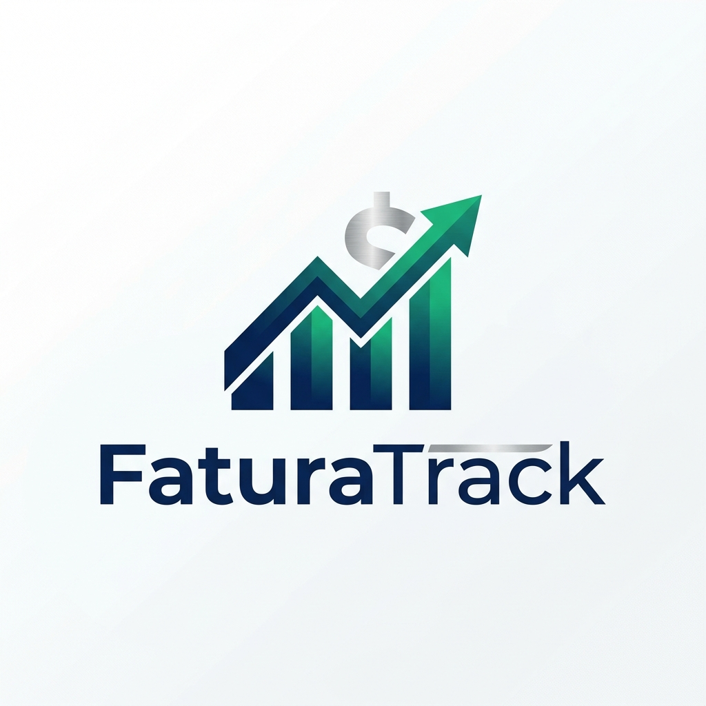

# <p align="center">FaturaTrack</p>

<p align="center">
  
</p>

<p align="center">
  <strong>Uma plataforma de análise de faturamento projetada para acompanhamento financeiro de alta performance.</strong>
</p>

---

## Visão Geral

O **FaturaTrack** é uma aplicação full-stack robusta, vai ser evoluida para analisar e gerenciar dados de faturamento com precisão. Originalmente concebido como um desafio técnico, ele evoluiu para uma solução moderna e conteinerizada para cálculo e visualização de métricas financeiras.

Com um frontend moderno em **Angular** (interface glassmorphic) e um backend de alta performance em **.NET 8**, o FaturaTrack demonstra as melhores práticas de desenvolvimento web moderno, incluindo arquitetura limpa e orquestração de containers.

## Principais Funcionalidades

- **Análise Inteligente**: Calcule métricas complexas de faturamento (menor/maior valor, dias acima da média) através de um motor de backend otimizado.
- **UI/UX Moderna**: Um dashboard elegante e responsivo construído com Angular, apresentando micro-animações e uma estética premium "glass".
- **Pronto para Nuvem**: Totalmente conteinerizado com Docker, garantindo uma implantação perfeita em qualquer ambiente.
- **Arquitetura Limpa**: Lógica de backend desacoplada usando Casos de Uso (Use Cases) e clara separação de responsabilidades.

## Stack Tecnológica

### Backend
- **Framework**: .NET 8
- **Linguagem**: C#
- **Arquitetura**: Clean Architecture
- **Documentação**: Swagger/OpenAPI

### Frontend
- **Framework**: Angular
- **Estilização**: CSS Vanilla
- **Lógica**: Gerenciamento de estado reativo com RxJS

### Infraestrutura
- **Conteinerização**: Docker & Docker Compose

##  Arquitetura

O backend segue uma arquitetura especializada projetada para escalabilidade:
- **Camada de API**: Endpoints RESTful com documentação completa no Swagger.
- **Camada de Aplicação**: Contém a lógica de negócio encapsulada em Casos de Uso (ex: `CalcularFaturamentoAnualUseCase`).
- **Camada de Domínio**: Entidades principais e regras de negócio.

##  Como Começar

### Pré-requisitos
- [Docker](https://www.docker.com/)
- [Docker Compose](https://docs.docker.com/compose/)

### Instalação

1. **Clone o repositório**:
   ```bash
   git clone https://github.com/ricardo08jr/FaturaTrack.git
   cd FaturaTrack
   ```

2. **Suba o ambiente**:
   ```bash
   docker-compose up --build
   ```

3. Após os serviços iniciarem, você poderá acessá-los nas seguintes URLs:
   - **Frontend (Angular):** [http://localhost:8080](http://localhost:8080)
  - **Documentação da API**: [http://localhost:3277/swagger/index.html](http://localhost:3277/swagger/index.html)

Para interromper a execução, pressione `Ctrl+C` no terminal ou execute o comando abaixo em outra janela do terminal na mesma pasta:

```bash
docker-compose down
```
