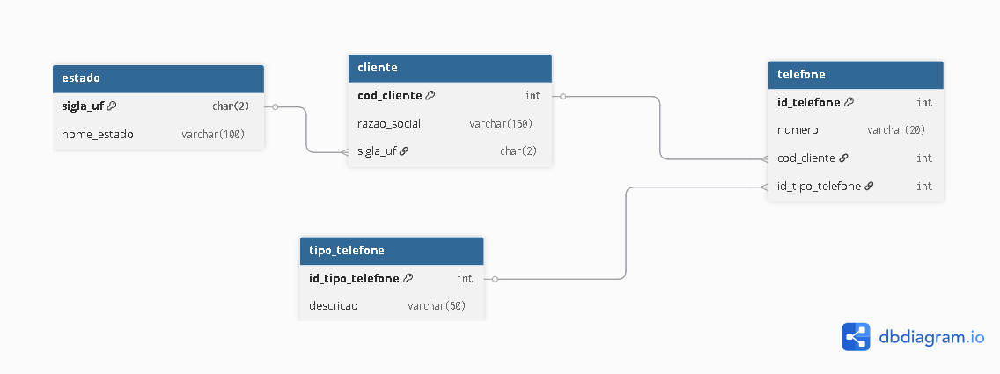

# Target Teste - Ricardo Junior

Este repositório contém a solução do desafio de desenvolvimento.

## Desafio

O documento completo com as instruções do desafio pode ser visualizado aqui:
[📄 Desafio Desenvolvedor PDF](./desafio_desenvolvedor.pdf)

## Diagrama do Banco de Dados

Abaixo está o diagrama do modelo de banco de dados. O script SQL correspondente pode ser encontrado na pasta `banco`.



## Como Rodar a Aplicação com Docker

A aplicação foi configurada para rodar facilmente utilizando o Docker Compose, subindo tanto a API (Backend) quanto o Frontend de uma só vez.

### Pré-requisitos
Certifique-se de ter o **Docker** e o **Docker Compose** instalados na sua máquina.

### Passos para Execução

1. Abra o terminal na raiz do projeto (onde o arquivo `docker-compose.yml` está localizado).
2. Execute o comando abaixo para construir as imagens e iniciar os containers:

   ```bash
   docker-compose up --build
   ```

3. Após os serviços iniciarem, você poderá acessá-los nas seguintes URLs:
   - **Frontend (Angular):** [http://localhost:8080](http://localhost:8080)
   - **Backend (API):** `http://localhost:3277`

Para interromper a execução, pressione `Ctrl+C` no terminal ou execute o comando abaixo em outra janela do terminal na mesma pasta:

```bash
docker-compose down
```